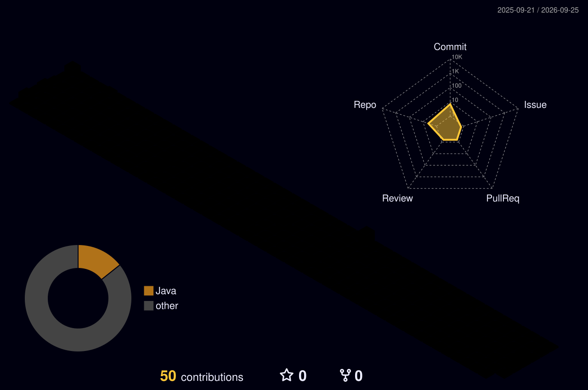

<!-- ⋆˙⟡ thanks for peeking under the hood —
     this profile is a living canvas: the 3D graph & snake below are
     generated nightly by GitHub Actions, nothing here is hand-drawn.
-->

<div align="center">


<a href="https://git.io/typing-svg"></a>

<br/>

[](https://portofolio-iota-drab-61.vercel.app/)
[](https://www.linkedin.com/in/harsha-rdy626/)
[](mailto:harshabobbiti626@gmail.com)

</div>

---

## ✦ About

```yaml
name: Harshavardhan Reddy Bobbiti
role: Backend Developer @ Capgemini — Nuuday Telecom
stack: [ Java, Spring Boot, Microservices, Redis, PostgreSQL, Kubernetes ]
now: >-
  engineering the Agentic AI prompt-pipeline —
  how prompts are evaluated, versioned & optimized
before: UI Developer @ Bhrish Labs (Nestlé partner) — React + TypeScript
edu: B.Tech CSBS @ SRM Institute — 9.2 GPA
certs: [ Meta Front-End Developer, Spring Microservices 5-in-1, CKAD — KodeKloud ]
```

> ⚡ *Started in frontend — so I build the APIs the frontend always wished existed.*

---

## ✦ Flagship Builds

**🛡️ [Tech-Sovereignty-Graph](https://github.com/Harshabobbiti626/Tech-Sovereignty-Graph)**
Enterprise-scale graph engine mapping identity access paths, nested group inheritance & Shadow-IT blast radius.
`Spring Boot` `openCypher` `Graph DB` `React Flow` `Docker`

**🔗 [Redis-Backed URL Shortener](https://github.com/Harshabobbiti626/Redis-Backed-URL-Shortener-Service)**
High-throughput engine where a Redis caching layer completely offloads PostgreSQL under concurrent fire.
`Spring Boot` `Redis` `PostgreSQL` `JWT` `Docker`

**📈 [Cloud-Native Metrics Pipeline](https://github.com/Harshabobbiti626/Cloud-Native-Metrics-Monitoring-Pipeline)**
Multithreaded ingestion engine parsing server performance metrics via the Streams API, gated by SonarQube + Checkstyle.
`Java 17` `Streams API` `SonarQube` `Docker`

---

## ✦ Toolbox

<div align="center">


<br/>
<i><sub>engineering · data</sub></i>
<br/><br/>

<br/>
<i><sub>platform · delivery</sub></i>

</div>

---

## ✦ GitHub

<div align="center">


<br/>


</div>

---

## ✦ Contribution Art

<div align="center">

<i><sub>regenerated nightly by GitHub Actions — nothing here is hand-drawn</sub></i>

<picture>
  <source media="(prefers-color-scheme: dark)" srcset="./profile-3d-contrib/profile-night-rainbow.svg" />
  <source media="(prefers-color-scheme: light)" srcset="./profile-3d-contrib/profile-season-animate.svg" />
  
</picture>

<br/>

<picture>
  <source media="(prefers-color-scheme: dark)" srcset="https://raw.githubusercontent.com/Harshabobbiti626/Harshabobbiti626/output/github-contribution-grid-snake-dark.svg" />
  <source media="(prefers-color-scheme: light)" srcset="https://raw.githubusercontent.com/Harshabobbiti626/Harshabobbiti626/output/github-contribution-grid-snake-light.svg" />
  
</picture>

</div>

---

<div align="center">


</div>
