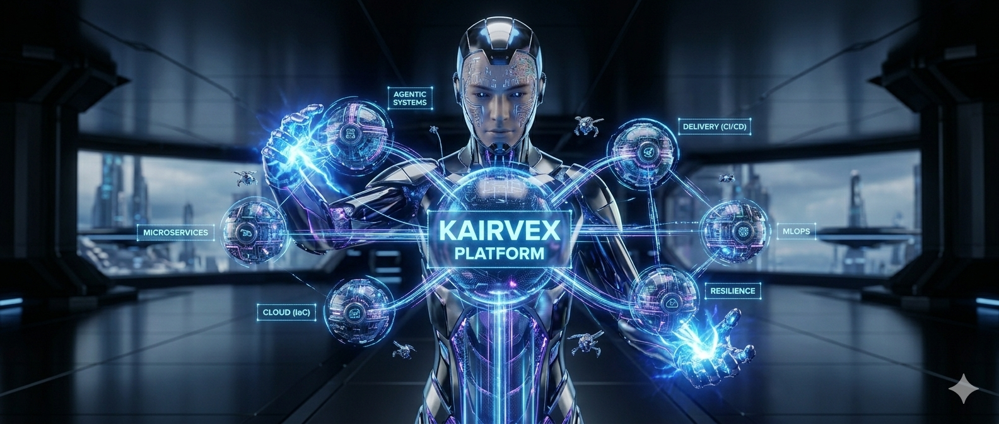

<!-- ⋆˙⟡ ENGINEER'S QUEST — a playable profile
     HUD, artifacts & skyline are live renders: the skyline is rebuilt nightly
     by GitHub Actions, everything else is hand-authored animated SVG.
     No image redirects except the Kairvex banner and the party links below.
-->

<div align="center">


<sub>[Player](#-act-i--the-player) · [Quest Log](#-act-ii--the-quest-log) · [Kairvex](#-act-iii--kairvex-saga) · [Skill Tree](#-the-skill-tree) · [High Scores](#-high-scores) · [Easter Eggs](#-easter-eggs) · [Party](#-join-the-party)</sub>

</div>


## ◆ ACT I · The Player

<div align="center">
  
  <br/>
  <sub><b>ENGINEER · LV 2+</b> — two years shipped to production, zero abandoned quests</sub>
</div>

```yaml
player:     Harshavardhan Reddy Bobbiti
class:      Backend Engineer — Java · Spring · K8s
guild:      Capgemini (Nuuday Telecom)
quest:      the Agentic Gallery — prompt evaluation, versioning & optimization
build:      full-stack origin → backend main tree
```

> ⚡ *Started in frontend — so I build the APIs the frontend always wished existed.*

<div align="center">
  
  <br/><sub><i>the loadout — api · data · cloud layers, floating in orbit</i></sub>
</div>

<details>
<summary><b>◈ Origin Story</b> — <i>where the stats were allocated</i></summary>
<br/>

- 🎓 **B.Tech — Computer Science & Business Systems** · SRM Institute · `9.2 GPA`
- 🧪 **Meta Front-End Developer** · Coursera
- 🌀 **Spring Boot Microservices 5-in-1** — Boot · Cloud · Docker · K8s · Udemy
- ☸️ **CKAD-track Kubernetes Application Developer** · KodeKloud

</details>


## ◆ ACT II · The Quest Log

**⚔️ ACTIVE — “The Agentic Gallery”** · `Capgemini` · 2025 → now
→ multi-threaded Java pipelines that evaluate, version & optimize AI prompts — faster text processing, lower LLM latency
→ deep JUnit + Mockito suite, SonarQube gates catching memory leaks & thread safety · **90% coverage held**
→ containerized with Docker, automated Jenkins + Maven builds · reward: *the frontend & AI teams plug in effortlessly*

**✅ COMPLETE — “The Frontend Campaign”** · `Bhrish Labs × Nestlé` · 2024–25
→ refactored an enterprise HR Requisition Platform to atomic design (atoms → organisms)
→ multi-step wizard forms via custom hooks & Context API — zero redundant components
→ debounced search, lazy loading & pagination killing DOM bottlenecks · **reward: −30% code footprint**


## ◆ ACT III · Kairvex Saga

<div align="center">
  <a href="https://github.com/Kairvex-Eco-System">
    
  </a>
  <br/><sub><i>an open-world map of running systems — six core artifacts, five side quests</i></sub>
</div>

#### ⬛ Core Artifacts

**🟨 `LEGENDARY` · [kairvex-platform](https://github.com/Kairvex-Eco-System/kairvex-platform)** — the control center: UI modules, microservices, infra provisioning & multi-agent pipelines in one hub

**🟪 `ELITE` · [kairvex-microservices](https://github.com/Kairvex-Eco-System/kairvex-microservices)** — DDD-bounded backend engine · Spring Cloud Gateway routing · transactional JWT parsing · `Java 17 · Spring Data JPA`

**🟪 `ELITE` · [kairvex-agentic-systems](https://github.com/Kairvex-Eco-System/kairvex-agentic-systems)** — autonomous intelligence layer: multi-agent orchestration, static test generation, structural RCA loops · `LangGraph · CrewAI · OpenAI tool calling`

**🟦 `RARE` · [kairvex-cloud](https://github.com/Kairvex-Eco-System/kairvex-cloud)** — infra as code: private networks, Azure Container Registry, AKS clusters · `Terraform`

**🟦 `RARE` · [kairvex-delivery](https://github.com/Kairvex-Eco-System/kairvex-delivery)** — the CI/CD engine: security scans, SonarQube & image-scan gates, blue-green + canary rollouts · `Jenkins · GitHub Actions`

**🟦 `RARE` · [kairvex-frontend](https://github.com/Kairvex-Eco-System/kairvex-frontend)** — enterprise shell: feature apps composed at atomic boundaries, no UI monolith · `React · TS · Module Federation`

#### ◈ Side Quests

**◇ [kairvex-data](https://github.com/Kairvex-Eco-System/kairvex-data)** polyglot persistence — PostgreSQL · Redis · MongoDB · Neo4j blast-radius
**◇ [kairvex-event-systems](https://github.com/Kairvex-Eco-System/kairvex-event-systems)** Kafka loops · transactional Outbox · idempotent consumers
**◇ [kairvex-resilience](https://github.com/Kairvex-Eco-System/kairvex-resilience)** chaos testbench — Resilience4j breakers · bulkheads · rate limits
**◇ [kairvex-mlops](https://github.com/Kairvex-Eco-System/kairvex-mlops)** release-risk prediction · registries · drift-retraining jobs
**◇ [kairvex-labs](https://github.com/Kairvex-Eco-System/kairvex-labs)** the sandbox — PoCs before production promotion


## ◆ The Skill Tree

<div align="center">


<br/><sub><i>tier 1 — main tree</i></sub>
<br/><br/>

<br/><sub><i>tier 2 — infrastructure branch</i></sub>

</div>

<details>
<summary><b>◈ Full Attribute Sheet</b></summary>
<br/>

| Attribute | Allocation |
| :--- | :--- |
| **Backend & Core** | Core Java, Spring Boot, Spring Data JPA, Hibernate, Node.js (Express), Microservices, REST APIs |
| **Frontend** | ReactJS, TypeScript, Module Federation, Context API, Redux Toolkit, Hooks |
| **Data & Caching** | PostgreSQL, MySQL, indexing & RDBMS optimization, Redis, pgvector, Neo4j, MongoDB |
| **Cloud & DevOps** | Docker, Kubernetes (CKAD), Azure AKS, Terraform, Jenkins, Maven, GitHub Actions, AWS |
| **Quality** | SonarQube gates, JUnit 5, Mockito, Jest, Vitest, Playwright E2E, Selenium |
| **AI & Agents** | LangGraph, CrewAI, OpenAI tool calling, vector embeddings, Azure AI Foundry |

</details>


## ◆ High Scores

<div align="center">
  <sub><i>career telemetry — live from the GitHub servers</i></sub>
  <br/><br/>
  
  
</div>

<div align="center">
  <sub><i>the trophy room — your contributions as a 3D skyline, rebuilt nightly</i></sub>
  <br/><br/>
  <picture>
    <source media="(prefers-color-scheme: dark)" srcset="./profile-3d-contrib/profile-night-rainbow.svg" />
    <source media="(prefers-color-scheme: light)" srcset="./profile-3d-contrib/profile-season-animate.svg" />
    
  </picture>
</div>


## ◆ Easter Eggs

<div align="center">
<sub><i>minigames — click to play</i></sub>
<br/><br/>

<details>
<summary><b>☕ the dev desk</b> — <i>someone fell asleep on the job again</i></summary>
<br/>

<br/><sub><i>compiling… the cat is supervising. coffee refills after this build.</i></sub>
</details>

<details>
<summary><b>🛸 the night orbit</b> — <i>the cube laps the planet every 14s — wave back</i></summary>
<br/>

<br/><sub><i>shipping to production takes a little space.</i></sub>
</details>

<details>
<summary><b>💎 the loot crystal</b> — <i>a rare drop — one per profile</i></summary>
<br/>

<br/><sub><i>drop rate: 100% for visitors who scroll this far.</i></sub>
</details>

</div>


## ◆ Join the Party

<div align="center">

**The next quest has an open party slot — bring your inbox.**

` 📧 ` [harshabobbiti626@gmail.com](mailto:harshabobbiti626@gmail.com)
` 🐺 ` [linkedin.com/in/harsha-rdy626](https://www.linkedin.com/in/harsha-rdy626/)
` 🏰 ` [the old castle (portfolio)](https://portofolio-iota-drab-61.vercel.app/)

<sub>Bengaluru, Karnataka · India · press ▶ to start</sub>

</div>

---

<div align="center">


</div>
